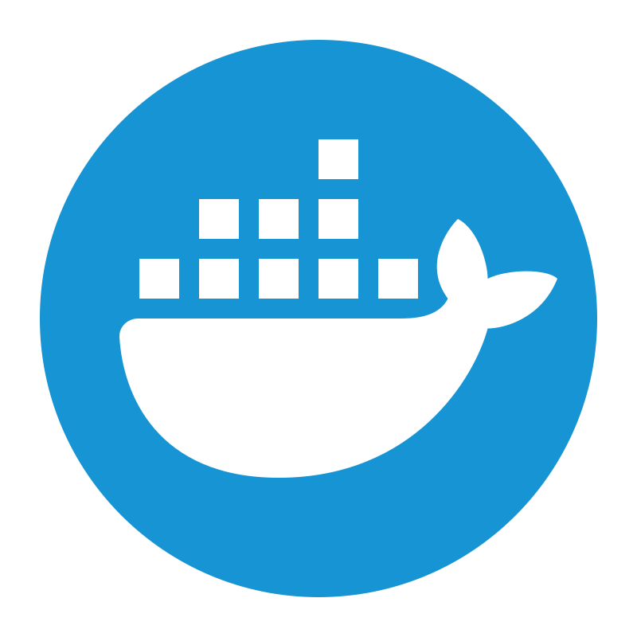

## Hi there, I'm Mathis LORENZO 

### Freelance Developer & <a href="https://epitech.eu">{Epitech.}</a> Graduate 

<!--  -->

## About me

Développeur freelance basé à Montpellier, diplômé d'**Epitech**. Je suis spécialisé en **développement mobile** (Flutter, iOS & Android) et en **développement web** (React.js, Next.js). J'ai conçu et livré des applications complètes pour des startups et PME, avec intégration de systèmes de paiement, géolocalisation, fonctionnalités temps réel et bien plus.

Je développe aussi des **extensions Chrome** pour résoudre des problèmes concrets, que ce soit pour aider les utilisateurs à trouver des produits d'occasion ou pour outiller les freelances avec des outils dopés à l'IA.

---

## Expériences & Projets

### 📱 Mobile

**+10 applications mobiles** livrées via [Mobify](https://mobify.fr) pour des startups et PME, avec paiements Stripe, géolocalisation, QR codes et fonctionnalités temps réel.

**Recolinks** (Premonia Sarl) `Flutter` `React.js` `Next.js`
> Plateforme de recommandations de confiance. Développement de l'app mobile cross-platform from scratch avec Flutter et de l'application web en React.js pour les professionnels. +1 000 recommandations générées dans les 2 premiers mois.

**Gawa** `Flutter` `Firebase` `Google Maps`
> Application de fidélité pour bars et restaurants. Système d'authentification Firebase, géolocalisation Google Maps, gestion multi-rôles (client, serveur, admin) et validation par QR codes.

**Protected** `Flutter` `API REST`
> Migration d'une application de sécurité en ligne vers une nouvelle API refondue. Zéro downtime, zéro bug critique post-lancement, et amélioration des performances de ~25%.

**Livroux** `Flutter` `Google Maps` `Firebase`
> Application de livraison locale. Conception du système de "Sous-Admin" pour cloisonner la gestion par zone géographique avec Google Maps. Déployé en 3 semaines sans interruption de service.

**DépanneVélo** `Flutter` `Stripe` `Firebase`
> MVP pour connecter des cyclistes en panne avec des dépanneurs. Authentification SMS, géolocalisation temps réel, paiement in-app via Stripe Connect. Lancé sur les stores en moins de 3 mois, note de 4.7/5.

**TrackIt** (partenaire AWS) `Flutter` `AWS` `CI/CD`
> Développement d'applications mobiles pour des acteurs majeurs du divertissement (FDJ, Canal+, ADN). Mise en place de pipelines CI/CD sur AWS et optimisation des infrastructures cloud existantes.

**Savetime** `Flutter` `AWS` `Docker` `Kubernetes`
> Développement de l'application mobile from scratch et migration de l'infrastructure web vers AWS (EC2, RDS, S3) avec Docker et Kubernetes. 99,9% d'uptime atteint.

### 🌐 Web

**Recolinks Web** `Next.js` `React.js`
> Plateforme web complémentaire à l'application mobile, développée en Next.js et React.js pour permettre aux professionnels de gérer et valoriser leur réseau de recommandations.

**[Mobify](https://mobify.fr)** `Next.js`
> Site vitrine de mon agence de développement mobile, construit avec Next.js.

**[Maltify](https://maltify.fr)** `Next.js`
> Site vitrine et landing page de l'extension Chrome Maltify, développé en Next.js.

### 🧩 Extensions Chrome

**Maltify** | [maltify.fr](https://maltify.fr) `Chrome Extension` `IA`
> Extension conçue pour simplifier le quotidien des freelances sur Malt. Dashboards d'analyses, optimisation de profil par IA, aide à la rédaction d'expériences cohérentes avec le profil, et génération de messages personnalisés pour la prospection.

**Okaz** | [okaz.tools](https://www.okaz.tools/) `Chrome Extension` `Projet de fin d'études Epitech`
> Extension qui aide les utilisateurs à trouver des produits d'occasion sur différentes plateformes pendant qu'ils naviguent sur des produits neufs. Elle récupère automatiquement les détails du produit (modèle, taille...) et propose des alternatives d'occasion correspondantes.

---

## Languages and Tools

|             |             |             |             |
| ----------- | ----------- | ----------- | ----------- |
|   | Flutter & Dart |   | React.js & Next.js |
|   | TypeScript & Python |   | Firebase & Supabase |
|   | Docker & AWS |   | Git & Github |
